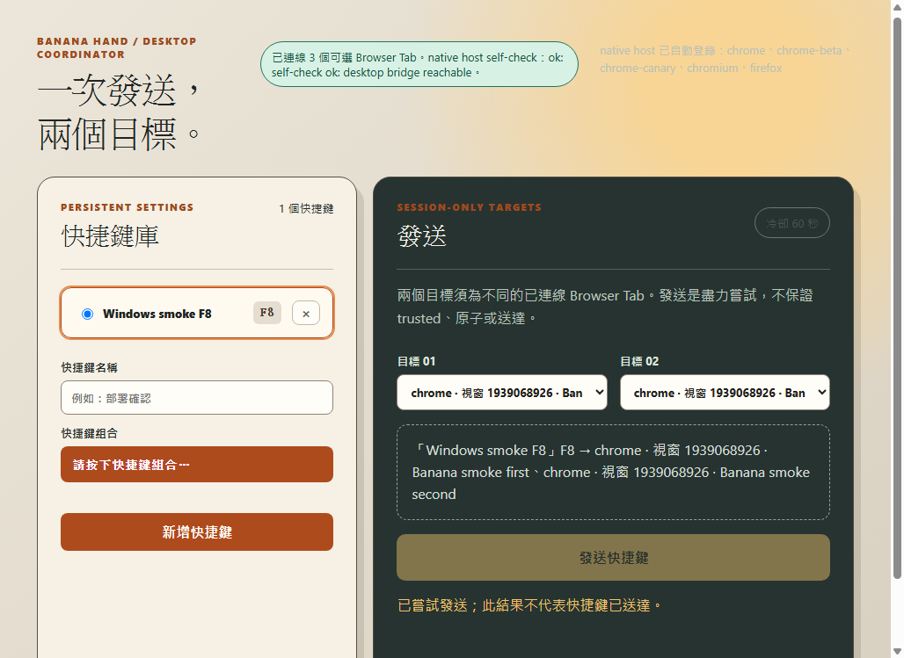

# Banana Hand

**選好兩個瀏覽器分頁，按一次按鈕，把同一組快捷鍵依序送到兩個目標。**

Banana Hand 適合已經在網站或網頁工具中使用快捷鍵，希望省去來回切換分頁、重複按鍵的人。你可以替快捷鍵取名字、儲存在清單裡，再選擇這次要操作的兩個分頁。

**第一次使用，要安裝兩個部分：桌面 App ＋ 瀏覽器插件。** 只安裝其中一個，還不能使用完整功能。一般使用者不需要安裝 Node.js、Rust，也不需要下載原始碼或自己編譯。

[下載 App 與插件](https://github.com/botio/banana-hand/releases) · [插件完整安裝教學](docs/browser-extension-installation.md) · [隱私權政策](PRIVACY.md)

> **目前版本：0.1.17。** Windows 版本已由使用者回報可正常使用；Chrome 前景切換及快捷鍵辨識問題已在這版修正。發布仍標為 **Preview／Pre-release**，表示尚未涵蓋所有電腦、網站與瀏覽器組合，不是要求你改用開發版瀏覽器。

## 目錄

- [先了解：它會做什麼？](#about)
- [下載：我應該選哪個檔案？](#downloads)
- [第一次安裝桌面 App](#desktop-install)
- [安裝 Chrome 或 Firefox 插件](#extensions)
- [確認已經連線](#connection)
- [第一次新增及發送快捷鍵](#first-dispatch)
- [看懂發送結果與冷卻時間](#results)
- [日常使用與更新](#updates)
- [常見問題](#faq)
- [回報問題與隱私](#support)
- [開發者文件與驗證紀錄](#development)

<a id="about"></a>

## 先了解：它會做什麼？

### 你需要準備

- 一台可以安裝 Banana Hand 的電腦。
- Google Chrome 或 Mozilla Firefox；有使用哪個瀏覽器，就在那個瀏覽器安裝插件。
- 兩個已開啟、可辨識的目標分頁。
- 一組你已經知道用途、並在目標網站手動測試過的快捷鍵。

### 它能做的事

- 儲存有名稱的快捷鍵，例如把你常用的某組按鍵命名為「執行動作」。
- 列出已連線瀏覽器的分頁，讓你選擇「目標 01」與「目標 02」。
- 先切換到第一個目標、嘗試送出快捷鍵，再處理第二個目標。
- 顯示連線狀態、發送結果及冷卻倒數。

### 使用前務必知道

- **兩個目標必須是不同分頁。** 同一個分頁不能同時選為目標 01、02。
- **不是背景操作。** 發送時瀏覽器視窗及分頁會切換到前景；請暫時不要操作滑鼠或鍵盤，也不要切到其他程式。
- **不是巨集或自動連點器。** 一次選擇一組快捷鍵，不支援把多段按鍵、文字、滑鼠動作或延遲串成腳本。
- **不會替網站新增快捷鍵。** 若網站原本不認得這組按鍵，送過去也不一定會有動作。
- **兩個目標不是同時、也不是原子完成。** 第一個可能已經執行，第二個卻失敗；不要因此直接重送兩個。
- **發送後有 60 秒全域冷卻。** 換一組快捷鍵或換分頁，也不能跳過這段等待。

第一次請用不會刪除資料、付款、送出表單或造成其他不可逆結果的操作測試。

<a id="downloads"></a>

## 下載：我應該選哪個檔案？

### 1. 開啟發布頁面

前往 **[Banana Hand Releases](https://github.com/botio/banana-hand/releases)**，找到要安裝的版本，再展開該版本下方的 **Assets**（下載檔案清單）。

- 第一次使用，選擇發布頁上較新的版本；本文以 **0.1.17** 為例。
- App 與插件建議從**同一個版本的發布頁**下載。
- 不要選 `Source code (zip)` 或 `Source code (tar.gz)`：那是原始碼，不是安裝程式。
- 看不到下載檔案時，先確認是否展開 Assets；不要把專案首頁的「Code → Download ZIP」當作安裝包。

### 2. 下載一份符合電腦的 App

| 你的電腦 | 要找的副檔名／檔名結尾 | 0.1.17 直接下載 |
| --- | --- | --- |
| Windows，Intel／AMD 64 位元（x64） | `_x64-setup.exe` | [Windows 安裝程式](https://github.com/botio/banana-hand/releases/download/v0.1.17/Banana.Hand_0.1.17_x64-setup.exe) |
| macOS，Apple Silicon（M 系列晶片） | `_aarch64.dmg` | [macOS 磁碟映像](https://github.com/botio/banana-hand/releases/download/v0.1.17/Banana.Hand_0.1.17_aarch64.dmg) |
| Linux，Debian／Ubuntu 類、x64 | `_amd64.deb` | [Linux DEB 套件](https://github.com/botio/banana-hand/releases/download/v0.1.17/Banana.Hand_0.1.17_amd64.deb) |
| Linux，其他適用的 x64 環境 | `_amd64.AppImage` | [Linux AppImage](https://github.com/botio/banana-hand/releases/download/v0.1.17/Banana.Hand_0.1.17_amd64.AppImage) |

目前沒有提供 macOS Intel 或 Windows ARM 的專用安裝包。Linux 輸入發送目前以 **X11** 為使用路徑，**Wayland 尚不能發送**；不要以為只裝插件就能解除這個限制。

### 3. 再下載一份符合瀏覽器的插件

| 你使用的瀏覽器 | 一般使用者要選的檔案 | 安裝方式 |
| --- | --- | --- |
| Google Chrome | [banana-hand-chromium-0.1.17.zip](https://github.com/botio/banana-hand/releases/download/v0.1.17/banana-hand-chromium-0.1.17.zip) | 解壓縮後，在 Chrome「載入未封裝項目」 |
| Mozilla Firefox | [banana-hand-firefox-0.1.17-signed.xpi](https://github.com/botio/banana-hand/releases/download/v0.1.17/banana-hand-firefox-0.1.17-signed.xpi) | 在 Firefox「從檔案安裝附加元件」；不需解壓縮 |

**一般使用者不要選這兩種檔案：**

- `banana-hand-chrome-webstore-*.zip`：供開發者提交 Chrome Web Store，不是本機安裝包。
- `banana-hand-firefox-temporary-*.zip`：供暫時載入及除錯，Firefox 重啟後需要重新載入。

如果你同時使用 Chrome 和 Firefox，就把各自的插件都裝好；桌面 App 只需安裝一份。目前的安裝教學不適用於 Edge、Brave 等其他瀏覽器，不要直接套用 Chrome 步驟並假設一定相容。

Firefox 插件需要**桌面版 Firefox 140 或更新版本**；本教學不適用於手機瀏覽器。

<a id="desktop-install"></a>

## 第一次安裝桌面 App

### Windows

1. 下載檔名以 `_x64-setup.exe` 結尾的安裝程式。
2. 如果已有 Banana Hand 正在執行，先關閉舊的 App 視窗。
3. 開啟下載的 `.exe`，依照安裝精靈完成安裝。一般情況使用預設選項即可，不需要自行修改登錄檔。
4. 安裝完成後，從開始功能表或安裝程式提供的捷徑開啟 **Banana Hand**。
5. 看到「快捷鍵庫」與「發送」面板後，保持 App 開著，再安裝瀏覽器插件。

**第一次下載或安裝被 Windows 提醒時：**

- 目前 Windows 安裝程式沒有 Authenticode 發行者簽章，可能出現不明發行者或信譽提示。
- 先確認來源是本專案的 GitHub Release、檔名及版本正確，再決定是否繼續。
- 若 Windows 顯示 SmartScreen 並提供「其他資訊／More info」與「仍要執行／Run anyway」，只有在你確認來源且信任程式時才使用這些選項。
- 如果公司或學校政策禁止執行，請交由管理員處理；不要停用防毒、SmartScreen 或安全政策。

安裝檔內含 WebView2 Runtime 離線安裝程式，檔案較大是正常的。**不需要另外安裝 Node.js、Rust 或所謂的 host 套件。**

### macOS（Apple Silicon）

1. 在 Apple 選單的「關於這台 Mac」確認是 M 系列晶片；目前提供的是 Apple Silicon 版本。
2. 下載並開啟 `_aarch64.dmg`。
3. 把 **Banana Hand.app** 拖到「應用程式」，不要一直從 DMG 裡執行。
4. 從「應用程式」開啟 Banana Hand。
5. 如系統要求「輔助使用／Accessibility」權限，前往「系統設定 → 隱私權與安全性 → 輔助使用」，允許目前安裝的 Banana Hand，必要時重新開啟 App。
6. 保持 App 開著，再安裝瀏覽器插件。

目前 DMG 內的 App 採 ad-hoc 簽署，沒有 Apple Developer ID／notarization，因此 macOS 可能攔截首次啟動。

**只在確認下載來源可信，而且已經把 App 放進「應用程式」後**，如果仍因隔離屬性無法開啟 App 或它內含的連線程式，可在「終端機」執行以下只針對 Banana Hand 的指令：

```sh
xattr -dr com.apple.quarantine "/Applications/Banana Hand.app"
```

然後重新開啟 App。這不是關閉整台電腦的 Gatekeeper；**不要改成移除整個「應用程式」資料夾的隔離屬性**。如果你不確定安全提示的原因，先保留完整提示並回報，不要盲目執行繞過指令。

### Linux

先確認目前桌面工作階段是 **X11**。可查看系統登入選項，或在終端機執行：

```sh
echo "$XDG_SESSION_TYPE"
```

輸出 `wayland` 時，這個版本會拒絕發送；需改用系統提供的 X11 工作階段。這不是插件安裝錯誤。

**Debian／Ubuntu 類系統**：用軟體安裝工具開啟 `.deb`，或在下載檔案所在目錄執行（下例為 0.1.17）：

```sh
sudo apt install ./Banana.Hand_0.1.17_amd64.deb
```

**AppImage**：在檔案管理員的檔案內容／權限中允許執行，再開啟；也可以在下載目錄執行：

```sh
chmod +x Banana.Hand_0.1.17_amd64.AppImage
./Banana.Hand_0.1.17_amd64.AppImage
```

AppImage 是否需要額外的系統元件，取決於 Linux 發行版。若無法啟動，請保留終端機錯誤，不要把桌面 App 改成用 `sudo` 執行，也不要先改瀏覽器安全設定。

<a id="extensions"></a>

## 安裝 Chrome 或 Firefox 插件

完整步驟、正確資料夾示意、更新方法與各種錯誤處理都在：

### [瀏覽器插件完整安裝教學](docs/browser-extension-installation.md)

快速對照如下；第一次使用建議直接看完整教學。

| Chrome | Firefox |
| --- | --- |
| 下載 `banana-hand-chromium-*.zip` | 下載 `banana-hand-firefox-*-signed.xpi` |
| **解壓縮**到固定、之後不會刪除的資料夾 | **不要解壓縮** XPI |
| 地址列輸入 `chrome://extensions` | 地址列輸入 `about:addons` |
| 開啟「開發人員模式／Developer mode」 | 開啟附加元件管理頁的齒輪選單 |
| 按「載入未封裝項目／Load unpacked」 | 選「從檔案安裝附加元件／Install Add-on From File…」 |
| 選擇**裡面直接有 `manifest.json`** 的資料夾 | 選擇剛下載的 `-signed.xpi` 檔案 |
| 確認 Banana Hand Browser Bridge 已啟用 | 確認安裝提示及權限，保持插件啟用 |

瀏覽器語言或版本不同，按鈕中文名稱可能略有差異，括號內的英文可用來對照。

**插件不提供另外一個發送視窗，也不需要按工具列圖示配對。** 日常操作都在 Banana Hand 桌面 App 裡完成。

<a id="connection"></a>

## 確認已經連線

1. 保持 Banana Hand App 開著。
2. 在**已安裝插件的瀏覽器設定檔**中，開啟兩個要使用的普通網頁分頁。
3. 等待 App 上方出現 **「已連線 … 個可選 Browser Tab」**。
4. 展開「目標 01」或「目標 02」下拉選單，確認看得到自己開啟的網頁標題。

**真正的完成標準是：App 裡看得到你的分頁。**

- 只有在瀏覽器管理頁看到插件，不代表它已連上 App。
- 只有「native host 已自動登錄」，代表 App 已準備連線設定，還不是插件連線成功。
- `native host self-check: ok` 代表 App 內建的連線程式通過自我檢查，仍要確認分頁清單。

`native host` 可以理解為 App 隨附的「本機連線助手」。一般使用者不需另外安裝它、輸入 ID、貼入路徑或手動建立設定檔。

App 與瀏覽器沒有固定的啟動先後順序。插件會自動重試；通常很快，但背景排程可能讓等待變長。初次安裝可先等約一分鐘；仍看不到分頁，再依完整教學的[連線檢查](docs/browser-extension-installation.md#connection)處理，不要連續重裝。

<a id="first-dispatch"></a>

## 第一次新增及發送快捷鍵



*上圖為 Windows 0.1.17 的實際測試畫面，已完成一次發送，因此按鈕正在冷卻。你的分頁標題、快捷鍵名稱和分頁數量會不同。*

### 1. 新增快捷鍵

1. 在左側「快捷鍵庫」下方的「**快捷鍵名稱**」輸入方便辨識的名稱。
2. 點一下「**快捷鍵組合**」的錄製按鈕。
3. 直接在鍵盤上按出你要儲存的組合，例如按住 `Ctrl`、`Shift`，再按 `K`。**不要逐字輸入 `C t r l + K`。**
4. 確認畫面已顯示你要的組合，再按「**新增快捷鍵**」。
5. 新增後，該快捷鍵會出現在清單中。點它前面的選取圓鈕即可選用。

可錄製的按鍵：

| 類別 | 支援範圍／注意事項 |
| --- | --- |
| 功能鍵 | `F1`～`F24`，可以單獨使用 |
| 字母、數字 | `A`～`Z`、`0`～`9`，需搭配至少一個修飾鍵 |
| 其他主要按鍵 | `Esc`、`Enter`、`Tab`、`Space`，需搭配至少一個修飾鍵 |
| 修飾鍵 | `Ctrl`、`Shift`、`Alt`、`Meta`；Meta 通常對應 Windows 鍵或 macOS Command 鍵 |
| 取消錄製 | 不搭配其他鍵，單按 `Esc` |

有些筆電需搭配 `Fn` 才會送出真正的 F 鍵；請以錄製按鈕最後顯示的內容為準。`F8` 是本文測試用例，**不代表每個網站都把 F8 設定成某個功能**。

要刪除不再使用的快捷鍵，按該項右側的「×」。刪除前先確認項目，沒有必要為了修改插件而刪除整個快捷鍵庫。

### 2. 選擇兩個分頁

1. 在右側「發送」面板的「**目標 01**」選第一個分頁。
2. 在「**目標 02**」選第二個、不同的分頁。
3. 確認快捷鍵已被選取。
4. 閱讀按鈕上方的摘要，核對**快捷鍵名稱、組合與兩個網頁標題**。

如果兩個分頁標題太像，先關閉不需要的分頁，或整理成容易辨識的視窗再選。不要只憑下拉選單的位置猜目標。

### 3. 發送一次，檢查兩邊

1. 確認兩個網頁都已載入，且這組快捷鍵在各自網頁中確實有用途。
2. 按一次「**發送快捷鍵**」。
3. 暫時放開滑鼠與鍵盤，讓 App 切換目標。
4. 查看下方結果，再分別查看兩個網頁是否完成預期動作。

如果按鈕是灰色，先檢查：是否有選快捷鍵、兩個目標是否仍連線且不同、是否還在冷卻。**不要靠連點嘗試解除灰色狀態。**

<a id="results"></a>

## 看懂發送結果與冷卻時間

| 你看到的訊息 | 代表什麼 | 接下來怎麼做 |
| --- | --- | --- |
| 「已嘗試發送」 | App 已嘗試發送，不是網站執行成功的收據 | 分別檢查兩個網站的實際結果 |
| `partial`／部分目標已嘗試 | 這次沒有完整完成；第一個目標可能已經執行 | **先核對兩邊，不要直接重送整組** |
| 「目標視窗沒有成為前景」 | 無法確認預期瀏覽器在前景，安全檢查拒絕繼續 | 確認版本、視窗、彈出對話框與焦點；不是把檢查關掉 |
| 「目標前景驗證逾時」 | 等待目標準備回覆時逾時，不能單靠這句斷定原因 | 先檢查連線與版本，保留完整訊息以便排查 |
| 「冷卻 … 秒」 | 全 App 共用的 60 秒等待時間尚未結束 | 等倒數結束，不用重裝插件 |
| 目標失效／已斷線 | 分頁關閉、移動或連線狀態改變，原選取可能已無效 | 重新確認分頁清單，再選取兩個目標 |

冷卻在第一個目標的輸入嘗試成功返回後開始；即使後面第二個目標發生問題，也可能仍在冷卻。這是為了降低重複送出風險，不是插件故障。

對付款、刪除、送出表單等不可逆操作，不要只看 App 的「已嘗試發送」就當作兩邊都成功，更不要把重送當成一般排錯步驟。

<a id="updates"></a>

## 日常使用與更新

### 每次開啟時

- 開啟 App 與要使用的瀏覽器，等待分頁出現在清單。
- 已儲存的快捷鍵會保留；**目標 01、02 要重新選取**，不會自動沿用上次的網頁。
- 發送期間不要切換程式、關閉目標分頁或操作其他快捷鍵。
- Chrome 插件的解壓縮資料夾要保留在原位置，不能裝完就當成暫存檔刪掉。

### 更新 App

目前採**手動更新**，不要等待 App 自己下載新版。

1. 從 [Releases](https://github.com/botio/banana-hand/releases) 下載新版 App；同時下載該版本對應的插件。
2. 完全退出舊版 Banana Hand。
3. Windows 執行新版安裝程式；macOS 替換「應用程式」裡的 App；Linux 安裝新套件或更換 AppImage。
4. 不需先刪除快捷鍵設定，也不要把「解除安裝並清除資料」當成一般更新流程。
5. 依照[插件更新步驟](docs/browser-extension-installation.md#updates)更新 Chrome／Firefox 插件。
6. 重新開啟 App，確認連線後重新選擇兩個目標。macOS 更新後若系統再次要求權限，請重新確認輔助使用授權。

Chrome 的本機載入版與這裡提供的 Firefox 已簽署 XPI，目前都應依本專案的手動更新方法處理。**「Firefox 已簽署」不等於已上架商店，也不代表已設定自動更新。**

<a id="faq"></a>

## 常見問題

### 插件裝好了，為什麼 App 還看不到分頁？

先確認 App 開著、插件啟用，而且網頁開在**安裝插件的同一個瀏覽器設定檔**。例如 Chrome 的「個人」和「工作」是不同設定檔，裝在其中一個不代表另一個也有。

等待重連後仍無分頁，依[完整排查表](docs/browser-extension-installation.md#troubleshooting)逐項檢查。初次測試先使用一般視窗及普通網頁；不要把無痕／私人瀏覽或瀏覽器內部設定頁當成第一個測試目標。

### 按插件圖示沒有反應，是壞了嗎？

不一定。這個插件是背景連線工具，**發送介面在桌面 App，不在工具列彈出視窗**。請用 App 的分頁清單判斷是否成功。

### Chrome 找不到「載入未封裝項目」？

確認開的是 `chrome://extensions`，且已開啟「開發人員模式」。如果開關不存在、無法啟用，或瀏覽器顯示由組織管理，可能受政策限制；請向管理員確認，不要嘗試繞過。

### Windows 又出現「目前前景：banana-hand.exe」？

先確認 App 使用 **0.1.17 或更新版本**，並重新啟動更新後的程式。接著確認 Chrome 視窗可正常操作，沒有阻擋中的對話框，發送期間沒有自行切換程式。

若仍出現同樣訊息，請回報完整錯誤與版本。不要把它當成「多按幾次一定會好」，也不要為了送出按鍵而停用前景檢查。

### 顯示「已嘗試發送」，但網頁沒變化？

先直接到該網頁，手動按一次同樣的組合，確認網站本來就會處理。再檢查網頁內的焦點位置，例如是否停在網址列、輸入框、彈出對話框，或快捷鍵被瀏覽器本身攔截。

如果手動可用、透過 App 不可用，保留使用的組合與兩個目標的操作結果回報；**不要用連續重送來測試可能重複執行的動作**。

### Linux Wayland 顯示權限或 portal 相關拒絕訊息？

目前 Wayland 發送尚未實作完成，不是授予一個權限就能修好。請改用可用的 X11 工作階段，或等待後續版本。

### 我需要輸入 extension ID、修改登錄檔或另外安裝 native host 嗎？

一般使用者不需要。這些是 App 自動處理或開發者除錯的細節。請先使用正確的 App 和插件檔案，遇到問題再依教學排查。

### 想停用或移除？

在瀏覽器的擴充功能／附加元件管理頁停用或移除 Banana Hand Browser Bridge；要移除桌面 App，使用作業系統正常的解除安裝方式。

**移除插件、移除 App、清除快捷鍵資料是不同事情。** 詳細順序與注意事項見[移除教學](docs/browser-extension-installation.md#removal)。

<a id="support"></a>

## 回報問題與隱私

遇到問題，可在 [GitHub Issues](https://github.com/botio/banana-hand/issues) 回報。請提供：

1. 作業系統與版本，例如 Windows 的版本及 x64／ARM 架構。
2. App 版本、瀏覽器名稱與版本、插件版本。
3. 問題出現在安裝、連線、選取分頁，還是發送階段。
4. App 的完整錯誤文字，必要時附遮蔽過的截圖。
5. 使用的快捷鍵，以及兩個目標各自實際發生什麼事；是否在同一瀏覽器、同一設定檔。

**GitHub Issues 是公開的。** 請遮蔽私人分頁標題、完整網址中的識別碼、帳號、密碼、權杖與其他敏感資料；不需要上傳整個瀏覽器設定檔或完整連線設定。

插件會處理已開啟分頁的標題、網址及識別資訊，讓本機 App 列出可選目標；不限於你最後選中的兩個分頁。這些資料不會由插件自動傳送到開發者伺服器。詳見[隱私權政策](PRIVACY.md)。

<a id="development"></a>

## 開發者文件與驗證紀錄

一般使用者不需要執行任何開發指令。想自行修改或編譯，請看[開發與打包說明](docs/development.md)。

目前可核對的 0.1.17 紀錄：

- [三平台發布與 Windows 安裝後檢查](https://github.com/botio/banana-hand/actions/runs/34188090969)：Windows、macOS、Linux 建置完成；Windows 已安裝程式通過啟動、登錄與連線助手自我檢查。
- [Windows 真實 Chromium 兩分頁測試](https://github.com/botio/banana-hand/actions/runs/34187904000)：每個分頁收到一次 `key: F8`、`code: F8`、`isTrusted: true`；包含實際桌面截圖。此測試使用測試專用 CDP 建置，不等同於在每一份已安裝發行版、每一種瀏覽器配對上都完成驗證。
- Windows 0.1.17 已有使用者正常使用的回報。個別成功結果不代表所有網站或電腦都相容；完整支援證據規則見 [ADR 0003](docs/adr/0003-release-evidence-matrix.md)。

[網域說明](CONTEXT.md) · [Wayland 技術限制](docs/wayland-remote-desktop-portal.md) · [發布檔案](https://github.com/botio/banana-hand/releases)
